# CS03 rerun on grok-4.7
Prompt: prompt_sent_CS03.txt (Set E text from manuscript v2.18 plus inputs). End: stopped by operator after turn 3 (no new generation calls allowed); turn 4 request was in flight and killed, its cost is not tracked. Cost: $0.343

---
## Turn 1 (2026-10-21T20:02:54-07:00)
### User
```
<mission>
Produce the documentation set below, get my approval, and only then plan code, so every
later coding turn reads one stable set of files instead of chat history.
</mission>

<agent>
Staff eng... [full prompt in prompt file]
```
### Usage
{"prompt_tokens": 3519, "completion_tokens": 24, "total_tokens": 5154, "prompt_tokens_details": {"text_tokens": 3519, "audio_tokens": 0, "image_tokens": 0, "cached_tokens": 1152}, "completion_tokens_details": {"reasoning_tokens": 1611, "audio_tokens": 0, "accepted_prediction_tokens": 0, "rejected_prediction_tokens": 0}, "num_sources_used": 0, "cost_in_usd_ticks": 151200000}
Stop: stop. Cost: $0.01512
### Assistant

I will verify the catalog header and the public book-page URL before writing assumptions. No code and no repo changes.

---
## Turn 2 (2026-10-21T20:03:08-07:00)
### User
```
Accepted, continue to the next phase.
```
### Usage
{"prompt_tokens": 3559, "completion_tokens": 4800, "total_tokens": 25840, "prompt_tokens_details": {"text_tokens": 3559, "audio_tokens": 0, "image_tokens": 0, "cached_tokens": 3456}, "completion_tokens_details": {"reasoning_tokens": 17481, "audio_tokens": 0, "accepted_prediction_tokens": 0, "rejected_prediction_tokens": 0}, "num_sources_used": 0, "cost_in_usd_ticks": 1356200000}
Stop: stop. Cost: $0.13562
### Assistant

Phase 1 is treated as accepted. The assumptions you did not itemize are written into the PRD so you can reject any of them at this gate. No code, no repo, and no install.

# docs/PRD.md

```markdown
# Product requirements

## Problem

Readers and teachers need a local way to search the Project Gutenberg catalog. The catalog is a large CSV. Spreadsheet search is slow and does not keep a reading list. The tool must not upload that data.

## Users

- A reader who searches for a book and saves a short list.
- A teacher who filters by language and type, often using a subject word.

## Goals and non-goals

### Goals

- Import a local catalog CSV into SQLite.
- Search title, author, and subject text.
- Filter by language and type.
- Show a link to each book page on gutenberg.org.
- Save one short reading list on this machine.
- Export that list as Markdown.

### Non-goals

- Accounts, roles, and remote sync.
- Downloading book files.
- Automatic catalog download.
- Editing catalog text.
- Ranking books by popularity.

## Definitions

- Catalog: book rows imported from the CSV.
- Reading list: books saved for this install.
- Query: text in the search box.
- Operator: the person who runs import on the machine.
- Text#: the catalog book id column.

## Assumptions

These fill gaps in the brief. Reject any item at this gate if it is wrong.

- A1. There is one shared local list. There is no login.
- A2. The UI is server-rendered HTML. There is no second frontend toolchain.
- A3. A query matches if Title, Authors, or Subjects contains it. The three fields are combined with OR.
- A4. Language and Type filters are optional. They match the full stored field. The match is case-insensitive and exact.
- A5. Search runs only when the query is non-empty, or a language is set, or a type is set.
- A6. Page size is 25. The constant name is PAGE_SIZE.
- A7. The reading list holds at most 30 books. The constant name is LIST_MAX.
- A8. Text# is unique. The value is stored as text, exactly as in the CSV.
- A9. The book link is a local template, not a server call. The default template is https://www.gutenberg.org/ebooks/{text_id}. That path shape is UNVERIFIED (not fetched today).
- A10. A successful re-import replaces catalog rows. It does not delete reading-list rows.
- A11. The app does not fetch the CSV. The operator puts the file on disk.
- A12. Language and Type choices come from stored values after import. This PRD defines no fixed enum.
- A13. The CSV encoding is UTF-8. A decode error fails the import.
- A14. Package versions are not chosen in this PRD. No version number is claimed.

## Functional requirements

### FR-01 Catalog import

The system shall import a local CSV into SQLite. It shall map fields by header name, not by column order. The required headers are Text#, Type, Issued, Title, Language, Authors, Subjects, LoCC, and Bookshelves.

Acceptance:

- Given a UTF-8 CSV with those headers and two data rows, When the operator runs import, Then both rows are stored and the stored catalog count is 2.
- Given the same headers in a different order, When import runs, Then each value is stored under the matching header name.
- Given a quoted Title that contains a comma, When import runs, Then the stored Title keeps that comma.
- Given a row with LoCC and Bookshelves set, When import runs, Then those values are stored even though the UI does not filter on them.

### FR-02 Re-import keeps the list

The system shall replace all catalog rows after a successful import. The system shall not delete reading-list rows during import.

Acceptance:

- Given one catalog book that is also on the reading list, When a new valid CSV imports a different book, Then the catalog contains only the new book and the list still has the old book.

### FR-03 Failed import changes nothing

The system shall keep the previous catalog when import fails. Failure includes a missing required header, invalid UTF-8, an empty Text#, a duplicate Text#, or a write error.

Acceptance:

- Given one stored book, When import is given a CSV with no Title header, Then import fails and that stored book remains.
- Given one stored book, When import is given two data rows with the same Text#, Then import fails and the stored catalog count remains 1.

### FR-04 Local file only

The system shall read the catalog only from a local regular file. The system shall not download or upload catalog data.

Acceptance:

- Given a CATALOG_CSV_PATH that starts with http:// or https://, When import runs, Then the system rejects the path and does not fetch it.
- Given a CATALOG_CSV_PATH that is a directory, When import runs, Then import fails and the previous catalog remains.

### FR-05 Search

The system shall treat the query as a literal substring. The system shall match Title, Authors, or Subjects. The match shall be case-insensitive. A percent sign or underscore in the query shall not be a wildcard.

Acceptance:

- Given books titled "Pride and Prejudice" and "Emma", When the user searches for "pride", Then the result includes "Pride and Prejudice" and excludes "Emma".
- Given only one book whose Title contains "%", When the user searches for "%", Then that book is eligible and a book without "%" is not matched by a wildcard.
- Given a book whose Subjects contain "France" and whose Title does not, When the user searches for "france", Then that book is eligible.

### FR-06 Language filter

The system shall filter by the full Language field when a language is selected. The match shall be case-insensitive and exact.

Acceptance:

- Given one book with Language "en" and one with Language "fr", When the user filters language to "en", Then only the "en" book is returned.
- Given a book with Language "en", When the user filters language to "en-us", Then that book is not returned.

### FR-07 Type filter

The system shall filter by the full Type field when a type is selected. The match shall be case-insensitive and exact.

Acceptance:

- Given one row with Type "Text" and one with Type "Sound", When the user filters type to "Text", Then only the "Text" row is returned.

### FR-08 Combined conditions

The system shall AND the active query, language, and type conditions. An empty condition shall not limit results. The query itself still uses OR across the three text fields.

Acceptance:

- Given an English Text book titled "Hamlet" and a French Text book titled "Hamlet", When the user searches "Hamlet" and sets language to "en", Then only the English book is returned.

### FR-09 Search guard

The system shall not return catalog rows when the query is empty and both filters are unset. Whitespace-only text counts as empty.

Acceptance:

- Given an empty query and both filters unset, When the user submits the form, Then the page asks for a query or a filter and shows no book rows.

### FR-10 Page size

The system shall return at most 25 books on a result page. Page numbers shall start at 1. The system shall offer the next page only when more matches exist.

Acceptance:

- Given 30 matches, When the user opens page 1, Then the page shows 25 books and a next-page control.
- Given those same matches, When the user opens page 2, Then the page shows the other 5 books and does not repeat page 1.
- Given page=abc, When the user requests results, Then the system rejects the page value and returns no catalog dump.

### FR-11 Sort

The system shall sort results by Title, case-insensitive, ascending. The system shall break ties by Text#, ascending, as text.

Acceptance:

- Given matching titles "b Book" and "A Book", When results render, Then "A Book" comes before "b Book".
- Given two matches with the same title and Text# values "10" and "2", When results render, Then "10" comes before "2".

### FR-12 Result fields

The system shall show Text#, Title, Authors, Language, Type, and Subjects for each result. The system shall show a book link when Text# matches the digits-only pattern.

Acceptance:

- Given a stored book with those fields set and a digits-only Text#, When it appears in results, Then each field is visible and the link is present.
- Given a stored book whose Text# is not digits only, When it appears in results, Then the row is shown and no external book link is rendered.

### FR-13 Book link template

The system shall build a digits-only book href from EBOOK_URL_TEMPLATE. The default template is https://www.gutenberg.org/ebooks/{text_id}. The server shall not request that URL. Tests shall check the configured string, not a live site. The default path is UNVERIFIED (not fetched today).

Acceptance:

- Given the default template and Text# 1342, When the row is shown, Then the href is exactly https://www.gutenberg.org/ebooks/1342.
- Given a search that shows a link, When the server handles that search, Then it does not open an outbound HTTP connection.

### FR-14 Add to reading list

The system shall add a catalog book when the user asks. It shall store Text#, Title, Authors, Language, Type, Subjects, and the href computed at add time.

Acceptance:

- Given a catalog book that is not on the list, When the user adds it, Then the list shows that Title, Authors, Language, Type, Subjects, and href.
- Given a later import that changes that catalog Title, When the user opens the list, Then the list still shows the Title stored at add time.

### FR-15 List cap

The system shall refuse a new Text# when the list already has 30 books.

Acceptance:

- Given a list of 30 books, When the user adds a different catalog book, Then the list still has 30 books and the page shows a refusal message.

### FR-16 List uniqueness

The system shall keep at most one reading-list row per Text#.

Acceptance:

- Given a Text# that is already on the list, When the user adds that Text# again, Then the list still has one row for it.

### FR-17 Remove

The system shall remove one reading-list row when the user asks.

Acceptance:

- Given a list that contains Text# 10, When the user removes Text# 10, Then the list has no row with Text# 10.

### FR-18 Persistence

The system shall store the reading list in SQLite. The system shall create the database file and tables when they are missing. The list shall remain after a process restart.

Acceptance:

- Given no file at DATABASE_PATH, When the app starts, Then the file exists and the search page loads with an empty catalog.
- Given one saved book and a stopped process, When a new process opens the same database file, Then the list still contains that book.

### FR-19 Markdown export

The system shall export the list as a Markdown download named reading-list.md. The first line shall be "# Reading list". Each later book line shall use the stored title as link text, the stored href, and the stored authors. Order shall match FR-26. The system shall escape title characters that break a Markdown link. The system shall replace line breaks in a title with a space.

Acceptance:

- Given one list book titled "Emma", authors "Austen, Jane", and href https://www.gutenberg.org/ebooks/158, When the user exports, Then the body contains the line "- [Emma](https://www.gutenberg.org/ebooks/158) by Austen, Jane".
- Given that export, When the body is checked, Then the first line is "# Reading list".
- Given an empty list, When the user exports, Then the body is "# Reading list" and there are no book lines.
- Given a title that contains "]" and a line break, When the user exports, Then the title does not break the link syntax and the line break is a space.
- Given a non-empty list, When the user exports, Then the response media type is text/markdown and the server opens no outbound HTTP connection.

### FR-20 Safe HTML

The system shall escape catalog and list text in HTML so stored markup renders as text.

Acceptance:

- Given a Title value "<script>alert(1)</script>", When a result page renders, Then the response has no script element created from that title.

### FR-21 CSRF

The system shall reject a state-changing POST that lacks a valid CSRF token from the same server.

Acceptance:

- Given a list of one book, When a POST adds or removes a book without the token, Then the list is unchanged and the response is a rejection.

### FR-22 Filter choices

The system shall build language and type choices from distinct stored values. It shall sort those choices ascending by displayed text.

Acceptance:

- Given catalog languages "fr" and "en" only, When the search page renders, Then the language control lists "en" then "fr" and lists no other language.

### FR-23 No browser upload

The system shall expose import only as a local operator command. The web UI shall not include a catalog file-upload control.

Acceptance:

- Given the search page HTML, When it is inspected, Then it contains no file input for a catalog upload.

### FR-24 No-match message

The system shall show a no-match message when a valid search returns zero rows.

Acceptance:

- Given no book matches "zzzz-no-such", When the user searches for that query, Then the page shows a no-match message and no book table rows.

### FR-25 Routes

The system shall serve only the routes below for this product. These routes are defined here. They are not an external API.

- GET / shows the search form, filter choices, and a link to the reading list.
- GET /search shows a guarded search result.
- GET /reading-list shows the saved list.
- POST /reading-list adds one book from the catalog.
- POST /reading-list/remove removes one saved book.
- GET /reading-list.md exports Markdown.

Acceptance:

- Given a started app and an empty database, When each GET route is requested, Then each route responds without a server error.
- Given a valid CSRF token and a known Text#, When each POST route is called, Then the list changes as named in FR-14 or FR-17.

### FR-26 List order

The system shall show and export the reading list in add order, oldest first.

Acceptance:

- Given an empty list, When the user adds book A and then book B, Then the list page and the export show A before B.

## Non-functional requirements

### Security

- NFR-S1. The system shall read CATALOG_CSV_PATH, DATABASE_PATH, and the optional EBOOK_URL_TEMPLATE from the environment. The repo shall not contain secret values. Path values are environment-only even though they are not passwords.
- NFR-S2. The system shall pass user input to SQL only as bound parameters. Given a query text that contains a SQL comment and a DROP statement, When search runs, Then the catalog row count is unchanged.
- NFR-S3. The system shall bind the web server to 127.0.0.1 by default. Given the default config, When the server starts, Then it listens on 127.0.0.1 only.
- NFR-S4. The system shall not log full catalog rows by default.

### Performance

- NFR-P1. The system shall not place more than 25 books in one HTML result page.
- NFR-P2. The system shall index Language, Type, and catalog Text# for exact lookup. A leading-wildcard title search may scan. No timing number is claimed. Timing for the full CSV is UNVERIFIED.
- NFR-P3. The system shall close the CSV file when import ends, including on failure.

### Accessibility

- NFR-A1. The system shall show a text label for the query input, the language filter, and the type filter. Each label shall be tied to its control.
- NFR-A2. The system shall present result rows in a table with column headers.
- NFR-A3. The system shall use the book title as the book link text.
- NFR-A4. The system shall keep search, paging, add, remove, and export usable from the keyboard alone. It shall not use a time limit.

## Traceability

Neither source file was read from disk today. Chat text supplied the brief and the header names. That chat text is data, not a file.

| ID | Source path | Status | Notes |
| --- | --- | --- | --- |
| FR-01 | pg_catalog.csv | UNVERIFIED (file not found) | Header names from the chat brief |
| FR-02 | docs/brief.md | UNVERIFIED (file not found) | Hand refresh plus saved list |
| FR-03 | docs/brief.md | UNVERIFIED (file not found) | Derived from A10 and A13 |
| FR-04 | docs/brief.md | UNVERIFIED (file not found) | Nothing uploaded; refresh by hand |
| FR-05 | docs/brief.md | UNVERIFIED (file not found) | Search title, author, or subject |
| FR-06 | docs/brief.md | UNVERIFIED (file not found) | Filter by language |
| FR-07 | docs/brief.md | UNVERIFIED (file not found) | Filter by Type |
| FR-08 | docs/brief.md | UNVERIFIED (file not found) | Derived from A3 and A4 |
| FR-09 | docs/brief.md | UNVERIFIED (file not found) | Derived from A5 |
| FR-10 | docs/brief.md | UNVERIFIED (file not found) | Derived from A6 |
| FR-11 | docs/brief.md | UNVERIFIED (file not found) | Derived sort rule |
| FR-12 | docs/brief.md | UNVERIFIED (file not found) | Result list |
| FR-13 | docs/brief.md | UNVERIFIED (file not found) | Link to gutenberg.org; path UNVERIFIED |
| FR-14 | docs/brief.md | UNVERIFIED (file not found) | Save a reading list |
| FR-15 | docs/brief.md | UNVERIFIED (file not found) | Derived from A7, short list |
| FR-16 | docs/brief.md | UNVERIFIED (file not found) | Derived from A8 |
| FR-17 | docs/brief.md | UNVERIFIED (file not found) | Needed to manage a saved list |
| FR-18 | docs/brief.md | UNVERIFIED (file not found) | Local SQLite |
| FR-19 | docs/brief.md | UNVERIFIED (file not found) | Export Markdown |
| FR-20 | docs/brief.md | UNVERIFIED (file not found) | Derived safety rule |
| FR-21 | docs/brief.md | UNVERIFIED (file not found) | Derived local web safety rule |
| FR-22 | docs/brief.md | UNVERIFIED (file not found) | Derived from A12 |
| FR-23 | docs/brief.md | UNVERIFIED (file not found) | Refresh by hand |
| FR-24 | docs/brief.md | UNVERIFIED (file not found) | Derived empty-result rule |
| FR-25 | docs/brief.md | UNVERIFIED (file not found) | Routes defined by this PRD |
| FR-26 | docs/brief.md | UNVERIFIED (file not found) | Derived list order |

## External facts

- Catalog URL supplied in chat: https://www.gutenberg.org/cache/epub/feeds/pg_catalog.csv. UNVERIFIED (not fetched today).
- User-reported size: 21,263,721 bytes. UNVERIFIED.
- User-reported row count: 79,634. UNVERIFIED. Import tests shall not require this count.
- User-reported measure date: 2026-10-21. UNVERIFIED.
- User-reported columns: Text#, Type, Issued, Title, Language, Authors, Subjects, LoCC, Bookshelves. UNVERIFIED (file not found).
- Default ebook path in A9 and FR-13. UNVERIFIED (not fetched today).

## Config names

The environment names are CATALOG_CSV_PATH, DATABASE_PATH, and optional EBOOK_URL_TEMPLATE. This document lists names only. It lists no values. PAGE_SIZE is 25. LIST_MAX is 30. Those two are constants, not secrets.

## Risks

- R1. The ebook path is UNVERIFIED. A wrong default sends users to a bad page. Tests must not need a live response.
- R2. Text# uniqueness in the real CSV is UNVERIFIED. Duplicates fail import under FR-03.
- R3. Language cell shape is UNVERIFIED. A multi-value cell will not exact-match one language code.
- R4. CSV encoding is UNVERIFIED. A non-UTF-8 file fails import under A13.
- R5. Full-file search speed is UNVERIFIED. Leading-wildcard search may scan about 80,000 rows.
- R6. A list snapshot can outlive a book removed from a later catalog.
- R7. docs/brief.md and pg_catalog.csv were not in a repo for this writing. Traceability stays unverified until those files are present.

## Out of scope

- Book file download and full text display.
- Filters or search on LoCC, Bookshelves, or Issued. Those columns are stored only.
- Accounts, sharing, and hosted deploy.
- Automatic fetch from gutenberg.org.
- A native desktop shell or a mobile app.
- Choosing third-party package versions. Those stay [NOT CHOSEN] until a later approved phase.
```

Gate: PASS

---
## Turn 3 (2026-10-21T20:07:18-07:00)
### User
```
Accepted, continue to the next phase.
```
### Usage
{"prompt_tokens": 8375, "completion_tokens": 6074, "total_tokens": 39701, "prompt_tokens_details": {"text_tokens": 8375, "audio_tokens": 0, "image_tokens": 0, "cached_tokens": 8320}, "completion_tokens_details": {"reasoning_tokens": 25252, "audio_tokens": 0, "accepted_prediction_tokens": 0, "rejected_prediction_tokens": 0}, "num_sources_used": 0, "cost_in_usd_ticks": 1922260000}
Stop: stop. Cost: $0.19223
### Assistant

Phase 3 design follows. No code, no repo, and no install.

# docs/diagrams/user-story-map.md

````markdown
# User story map

Covers FR-01, FR-05, FR-06, FR-07, FR-14, FR-17, FR-19, and FR-23.

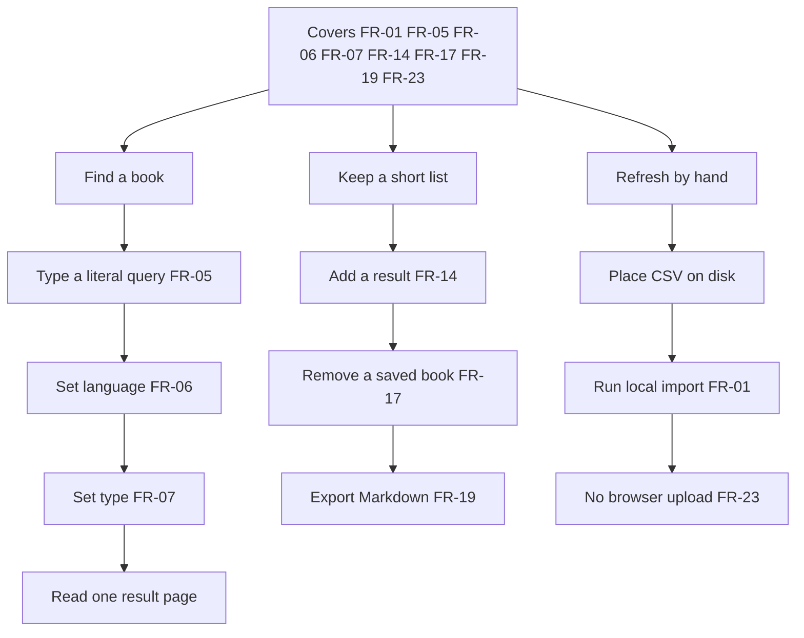
```mermaid
flowchart TB
  cover["Covers FR-01 FR-05 FR-06 FR-07 FR-14 FR-17 FR-19 FR-23"]
  find["Find a book"]
  keep["Keep a short list"]
  refresh["Refresh by hand"]
  cover --> find
  cover --> keep
  cover --> refresh
  find --> t1["Type a literal query FR-05"]
  t1 --> t2["Set language FR-06"]
  t2 --> t3["Set type FR-07"]
  t3 --> t4["Read one result page"]
  keep --> t5["Add a result FR-14"]
  t5 --> t6["Remove a saved book FR-17"]
  t6 --> t7["Export Markdown FR-19"]
  refresh --> t8["Place CSV on disk"]
  t8 --> t9["Run local import FR-01"]
  t9 --> t10["No browser upload FR-23"]
```
````

# docs/diagrams/use-case.md

````markdown
# Use case

Covers FR-01, FR-04, FR-05, FR-09, FR-14, FR-15, FR-17, FR-19, FR-23, and FR-25.

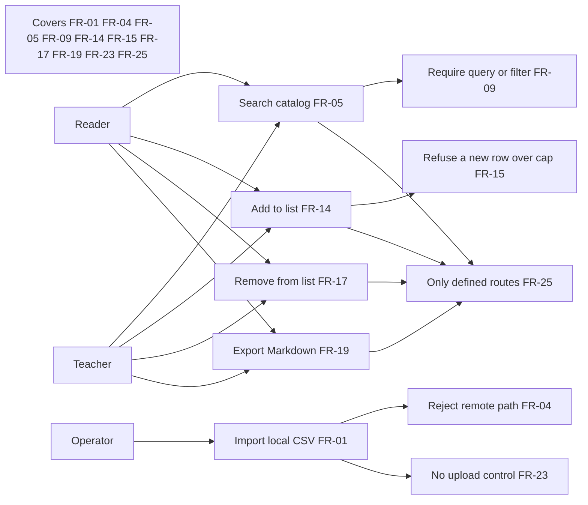
```mermaid
flowchart LR
  cover["Covers FR-01 FR-04 FR-05 FR-09 FR-14 FR-15 FR-17 FR-19 FR-23 FR-25"]
  reader["Reader"]
  teacher["Teacher"]
  operator["Operator"]
  search["Search catalog FR-05"]
  guard["Require query or filter FR-09"]
  add["Add to list FR-14"]
  cap["Refuse a new row over cap FR-15"]
  remove["Remove from list FR-17"]
  export["Export Markdown FR-19"]
  importFile["Import local CSV FR-01"]
  localOnly["Reject remote path FR-04"]
  noUpload["No upload control FR-23"]
  routes["Only defined routes FR-25"]
  reader --> search
  teacher --> search
  reader --> add
  teacher --> add
  reader --> remove
  teacher --> remove
  reader --> export
  teacher --> export
  operator --> importFile
  search --> guard
  search --> routes
  add --> cap
  add --> routes
  remove --> routes
  export --> routes
  importFile --> localOnly
  importFile --> noUpload
```
````

# docs/diagrams/architecture.md

````markdown
# Architecture diagram

Covers FR-04, FR-13, FR-18, FR-20, FR-21, FR-23, and FR-25.

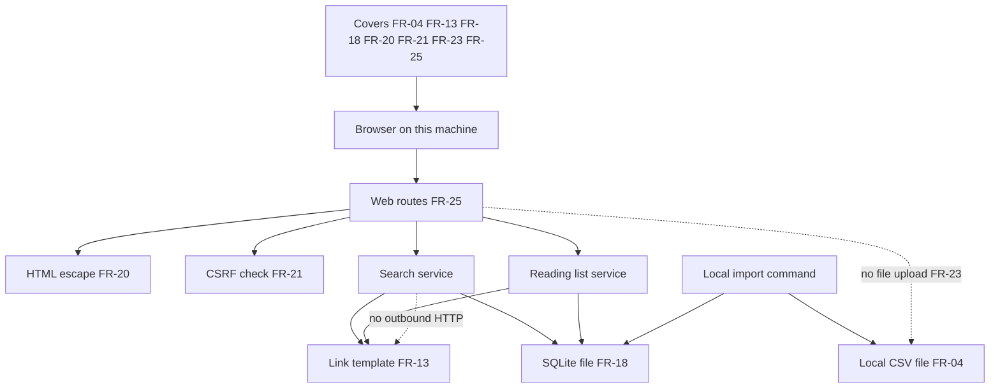
```mermaid
flowchart TB
  cover["Covers FR-04 FR-13 FR-18 FR-20 FR-21 FR-23 FR-25"]
  browser["Browser on this machine"]
  web["Web routes FR-25"]
  pages["HTML escape FR-20"]
  csrf["CSRF check FR-21"]
  search["Search service"]
  lists["Reading list service"]
  links["Link template FR-13"]
  db["SQLite file FR-18"]
  importer["Local import command"]
  csv["Local CSV file FR-04"]
  cover --> browser
  browser --> web
  web --> pages
  web --> csrf
  web --> search
  web --> lists
  search --> links
  search --> db
  lists --> links
  lists --> db
  importer --> csv
  importer --> db
  web -.->|"no file upload FR-23"| csv
  search -.->|"no outbound HTTP"| links
```
````

# docs/diagrams/sequence-startup.md

````markdown
# Sequence: startup

Covers FR-18.

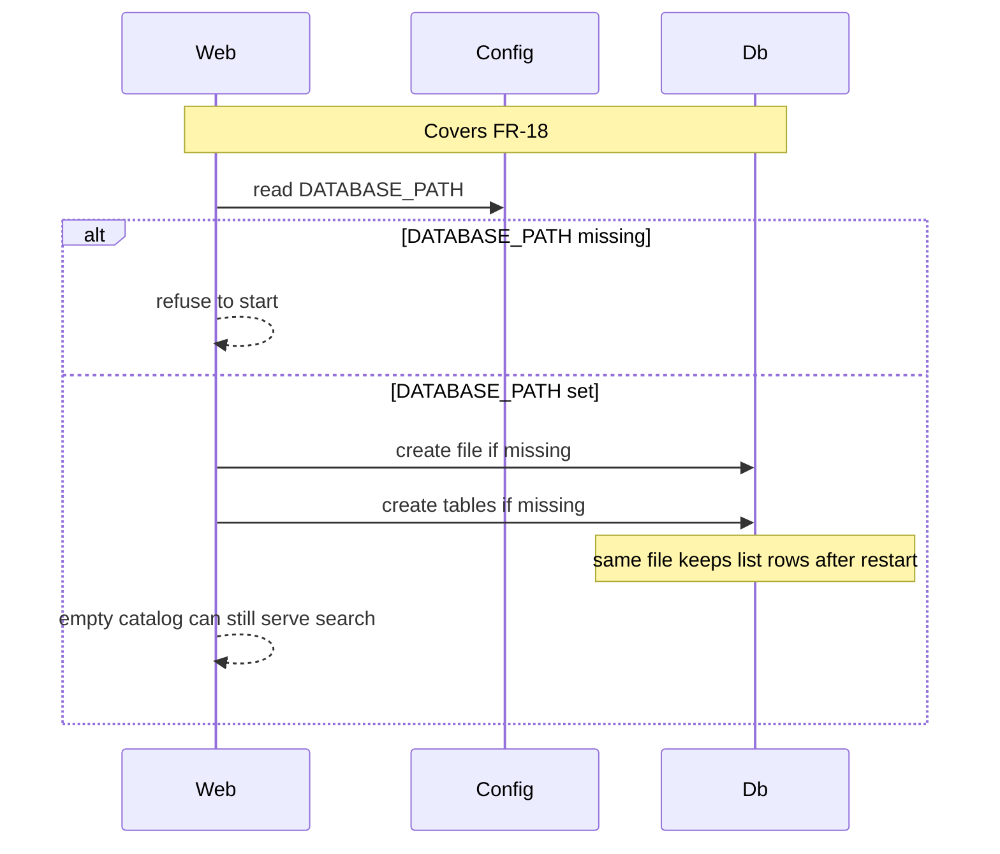
```mermaid
sequenceDiagram
  participant Web
  participant Config
  participant Db
  Note over Web,Db: Covers FR-18
  Web->>Config: read DATABASE_PATH
  alt DATABASE_PATH missing
    Web-->>Web: refuse to start
  else DATABASE_PATH set
    Web->>Db: create file if missing
    Web->>Db: create tables if missing
    Note over Db: same file keeps list rows after restart
    Web-->>Web: empty catalog can still serve search
  end
```
````

# docs/diagrams/sequence-import.md

````markdown
# Sequence: import

Covers FR-01, FR-02, FR-03, and FR-04.

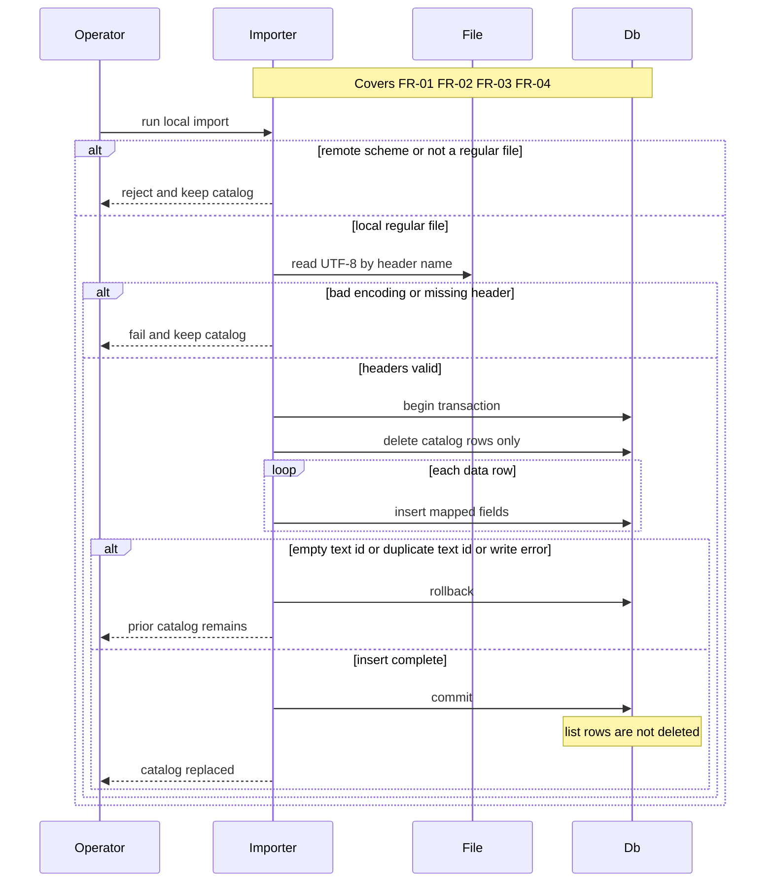
```mermaid
sequenceDiagram
  participant Operator
  participant Importer
  participant File
  participant Db
  Note over Importer,Db: Covers FR-01 FR-02 FR-03 FR-04
  Operator->>Importer: run local import
  alt remote scheme or not a regular file
    Importer-->>Operator: reject and keep catalog
  else local regular file
    Importer->>File: read UTF-8 by header name
    alt bad encoding or missing header
      Importer-->>Operator: fail and keep catalog
    else headers valid
      Importer->>Db: begin transaction
      Importer->>Db: delete catalog rows only
      loop each data row
        Importer->>Db: insert mapped fields
      end
      alt empty text id or duplicate text id or write error
        Importer->>Db: rollback
        Importer-->>Operator: prior catalog remains
      else insert complete
        Importer->>Db: commit
        Note over Db: list rows are not deleted
        Importer-->>Operator: catalog replaced
      end
    end
  end
```
````

# docs/diagrams/sequence-search.md

````markdown
# Sequence: search

Covers FR-05, FR-06, FR-07, FR-08, FR-09, FR-10, FR-11, FR-12, FR-13, FR-22, FR-24, and FR-25.

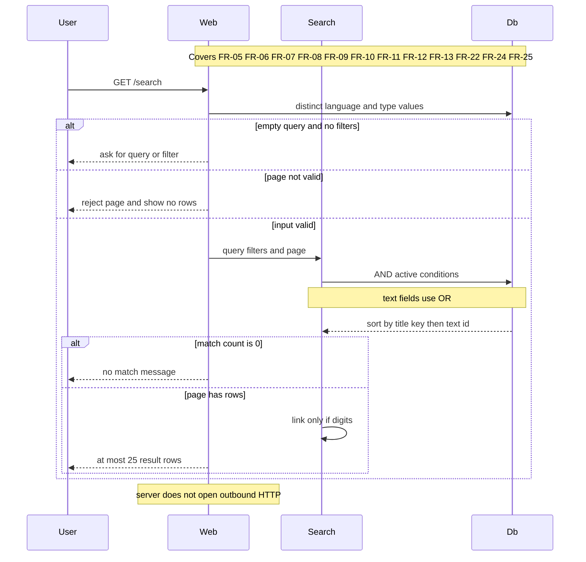
```mermaid
sequenceDiagram
  participant User
  participant Web
  participant Search
  participant Db
  Note over Web,Db: Covers FR-05 FR-06 FR-07 FR-08 FR-09 FR-10 FR-11 FR-12 FR-13 FR-22 FR-24 FR-25
  User->>Web: GET /search
  Web->>Db: distinct language and type values
  alt empty query and no filters
    Web-->>User: ask for query or filter
  else page not valid
    Web-->>User: reject page and show no rows
  else input valid
    Web->>Search: query filters and page
    Search->>Db: AND active conditions
    Note over Search,Db: text fields use OR
    Db-->>Search: sort by title key then text id
    alt match count is 0
      Web-->>User: no match message
    else page has rows
      Search->>Search: link only if digits
      Web-->>User: at most 25 result rows
    end
  end
  Note over Web: server does not open outbound HTTP
```
````

# docs/diagrams/sequence-reading-list.md

````markdown
# Sequence: reading list changes

Covers FR-14, FR-15, FR-16, FR-17, FR-21, and FR-26.

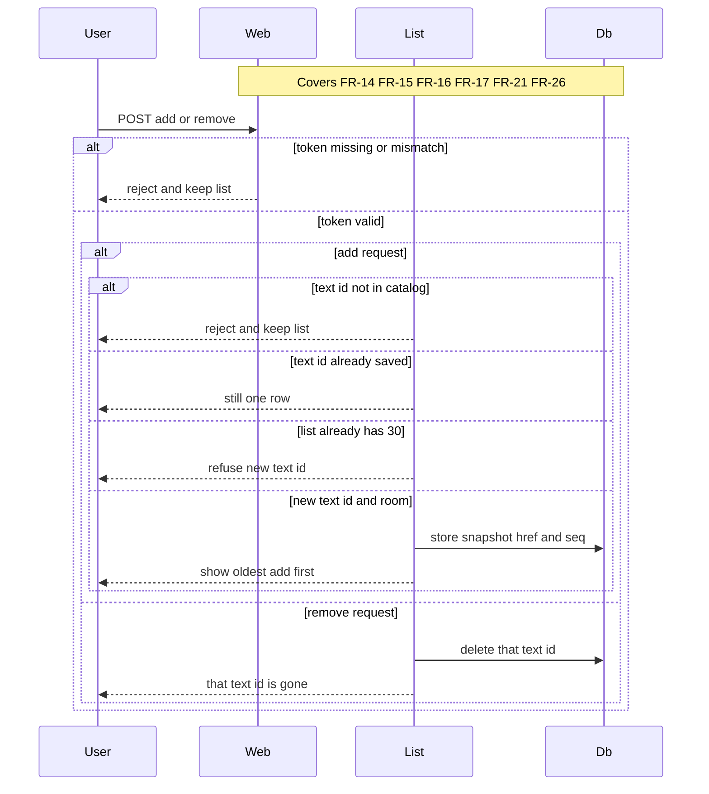
```mermaid
sequenceDiagram
  participant User
  participant Web
  participant List
  participant Db
  Note over Web,Db: Covers FR-14 FR-15 FR-16 FR-17 FR-21 FR-26
  User->>Web: POST add or remove
  alt token missing or mismatch
    Web-->>User: reject and keep list
  else token valid
    alt add request
      alt text id not in catalog
        List-->>User: reject and keep list
      else text id already saved
        List-->>User: still one row
      else list already has 30
        List-->>User: refuse new text id
      else new text id and room
        List->>Db: store snapshot href and seq
        List-->>User: show oldest add first
      end
    else remove request
      List->>Db: delete that text id
      List-->>User: that text id is gone
    end
  end
```
````

# docs/diagrams/sequence-export.md

````markdown
# Sequence: export

Covers FR-19 and FR-26.

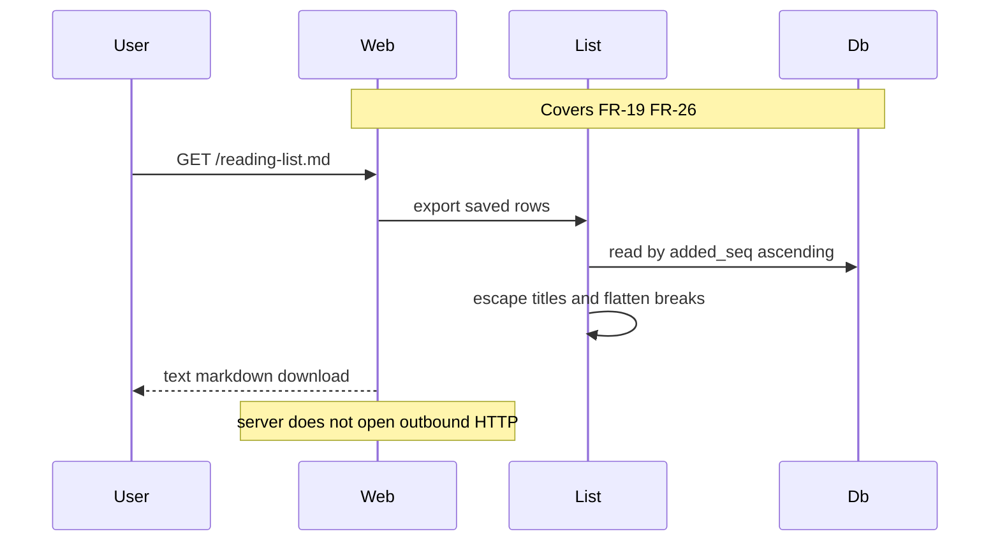
```mermaid
sequenceDiagram
  participant User
  participant Web
  participant List
  participant Db
  Note over Web,Db: Covers FR-19 FR-26
  User->>Web: GET /reading-list.md
  Web->>List: export saved rows
  List->>Db: read by added_seq ascending
  List->>List: escape titles and flatten breaks
  Web-->>User: text markdown download
  Note over Web: server does not open outbound HTTP
```
````

# docs/diagrams/data-flow.md

````markdown
# Data flow

Covers FR-01, FR-04, FR-05, FR-19, and FR-20.

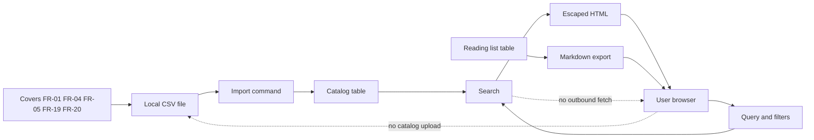
```mermaid
flowchart LR
  cover["Covers FR-01 FR-04 FR-05 FR-19 FR-20"]
  csv["Local CSV file"]
  importer["Import command"]
  catalog["Catalog table"]
  query["Query and filters"]
  search["Search"]
  html["Escaped HTML"]
  list["Reading list table"]
  export["Markdown export"]
  user["User browser"]
  cover --> csv
  csv --> importer
  importer --> catalog
  user --> query
  query --> search
  catalog --> search
  search --> html
  html --> user
  list --> export
  export --> user
  user -.->|"no catalog upload"| csv
  search -.->|"no outbound fetch"| user
```
````

# docs/diagrams/erd.md

````markdown
# ERD

Covers FR-01, FR-02, FR-14, FR-16, FR-18, and FR-26.

There is no foreign key. A list row may outlive its catalog row.

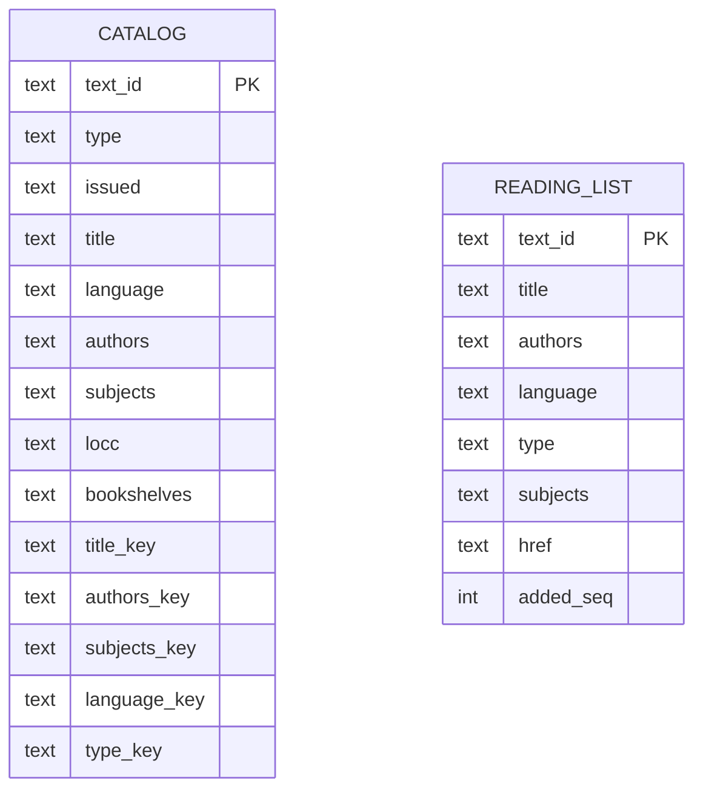
```mermaid
erDiagram
  CATALOG {
    text text_id PK
    text type
    text issued
    text title
    text language
    text authors
    text subjects
    text locc
    text bookshelves
    text title_key
    text authors_key
    text subjects_key
    text language_key
    text type_key
  }
  READING_LIST {
    text text_id PK
    text title
    text authors
    text language
    text type
    text subjects
    text href
    int added_seq
  }
```
````

# docs/diagrams/state.md

````markdown
# State

## Import

Covers FR-03.

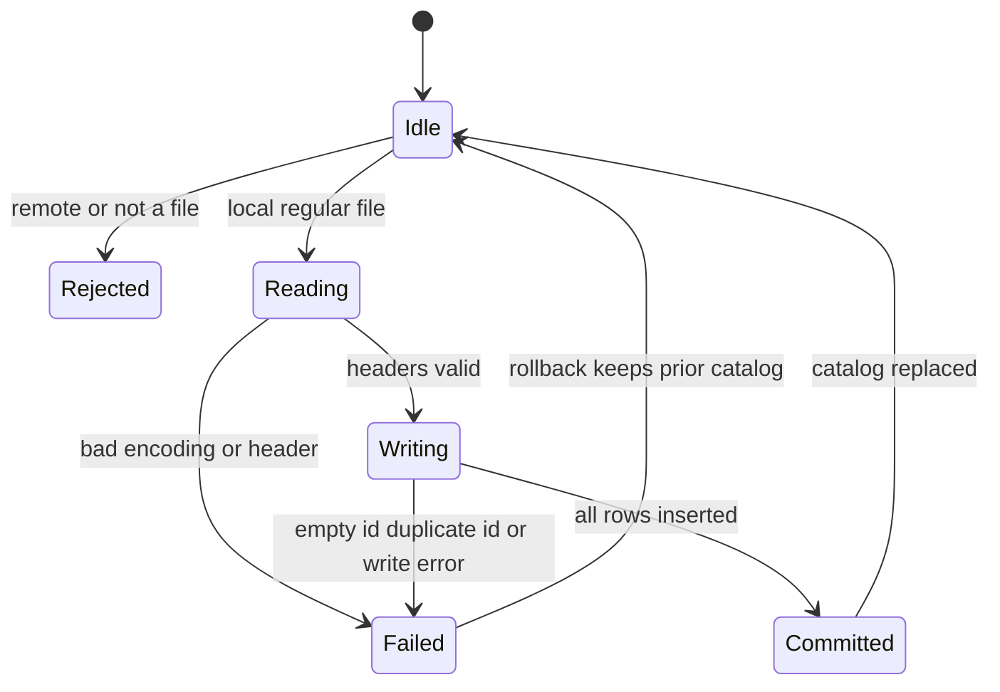
```mermaid
stateDiagram-v2
  [*] --> Idle
  Idle --> Rejected: remote or not a file
  Idle --> Reading: local regular file
  Reading --> Failed: bad encoding or header
  Reading --> Writing: headers valid
  Writing --> Failed: empty id duplicate id or write error
  Writing --> Committed: all rows inserted
  Failed --> Idle: rollback keeps prior catalog
  Committed --> Idle: catalog replaced
```

## Search response

Covers FR-09 and FR-24.

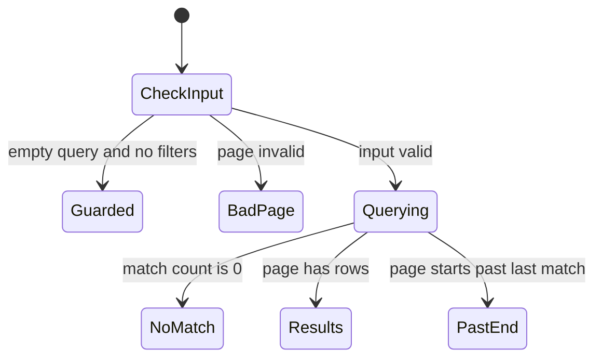
```mermaid
stateDiagram-v2
  [*] --> CheckInput
  CheckInput --> Guarded: empty query and no filters
  CheckInput --> BadPage: page invalid
  CheckInput --> Querying: input valid
  Querying --> NoMatch: match count is 0
  Querying --> Results: page has rows
  Querying --> PastEnd: page starts past last match
```

## Reading list

Covers FR-15, FR-16, and FR-21.

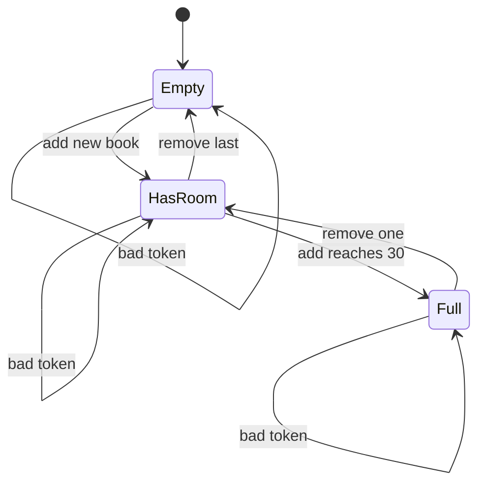
```mermaid
stateDiagram-v2
  [*] --> Empty
  Empty --> HasRoom: add new book
  HasRoom --> HasRoom: add while under cap
  HasRoom --> HasRoom: duplicate add
  HasRoom --> Full: add reaches 30
  Full --> Full: new add refused
  Full --> Full: duplicate add
  Full --> HasRoom: remove one
  HasRoom --> Empty: remove last
  Empty --> Empty: bad token
  HasRoom --> HasRoom: bad token
  Full --> Full: bad token
```
````

# docs/diagrams/class.md

````markdown
# Class

The label chart names every FR. The class chart shows module ownership.

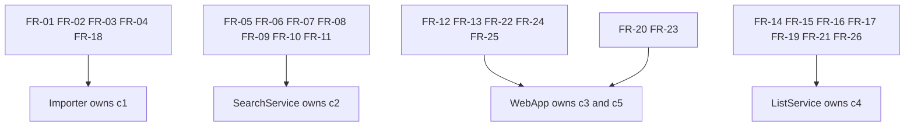
```mermaid
flowchart TB
  c1["FR-01 FR-02 FR-03 FR-04 FR-18"]
  c2["FR-05 FR-06 FR-07 FR-08 FR-09 FR-10 FR-11"]
  c3["FR-12 FR-13 FR-22 FR-24 FR-25"]
  c4["FR-14 FR-15 FR-16 FR-17 FR-19 FR-21 FR-26"]
  c5["FR-20 FR-23"]
  importer["Importer owns c1"]
  search["SearchService owns c2"]
  web["WebApp owns c3 and c5"]
  lists["ListService owns c4"]
  c1 --> importer
  c2 --> search
  c3 --> web
  c5 --> web
  c4 --> lists
```

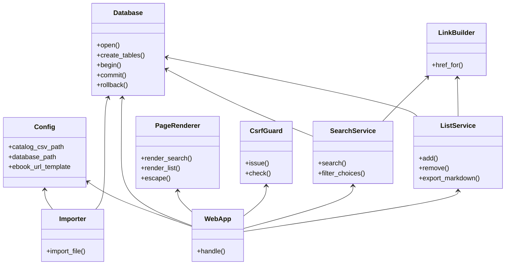
```mermaid
classDiagram
  class Config {
    +catalog_csv_path
    +database_path
    +ebook_url_template
  }
  class Database {
    +open()
    +create_tables()
    +begin()
    +commit()
    +rollback()
  }
  class Importer {
    +import_file()
  }
  class SearchService {
    +search()
    +filter_choices()
  }
  class ListService {
    +add()
    +remove()
    +export_markdown()
  }
  class LinkBuilder {
    +href_for()
  }
  class PageRenderer {
    +render_search()
    +render_list()
    +escape()
  }
  class CsrfGuard {
    +issue()
    +check()
  }
  class WebApp {
    +handle()
  }
  Config <-- Importer
  Config <-- WebApp
  Database <-- Importer
  Database <-- SearchService
  Database <-- ListService
  Database <-- WebApp
  LinkBuilder <-- SearchService
  LinkBuilder <-- ListService
  PageRenderer <-- WebApp
  CsrfGuard <-- WebApp
  SearchService <-- WebApp
  ListService <-- WebApp
```
````

# docs/diagrams/gui-mockup.md

````markdown
# GUI mockup

Covers FR-09, FR-10, FR-12, FR-14, FR-17, FR-19, FR-20, FR-22, FR-23, FR-24, FR-25, and FR-26.

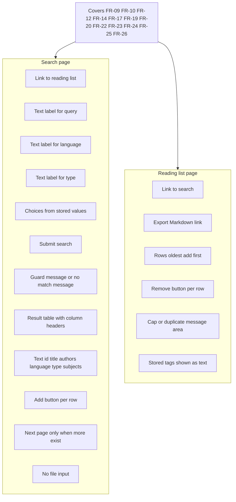
```mermaid
flowchart TB
  cover["Covers FR-09 FR-10 FR-12 FR-14 FR-17 FR-19 FR-20 FR-22 FR-23 FR-24 FR-25 FR-26"]
  subgraph searchPage [Search page]
    nav["Link to reading list"]
    queryLabel["Text label for query"]
    langLabel["Text label for language"]
    typeLabel["Text label for type"]
    choices["Choices from stored values"]
    submit["Submit search"]
    guard["Guard message or no match message"]
    table["Result table with column headers"]
    fields["Text id title authors language type subjects"]
    addBtn["Add button per row"]
    nextPage["Next page only when more exist"]
    noFile["No file input"]
  end
  subgraph listPage [Reading list page]
    back["Link to search"]
    exportLink["Export Markdown link"]
    order["Rows oldest add first"]
    removeBtn["Remove button per row"]
    capMsg["Cap or duplicate message area"]
    plainText["Stored tags shown as text"]
  end
  cover --> searchPage
  cover --> listPage
```
````

# docs/ARCHITECTURE.md

````markdown
# Architecture

This file is the design for the local catalog tool. If it conflicts with docs/PRD.md, the PRD wins. This phase does not approve code.

## Components

The web process serves HTML on this machine. The import command is separate. Both use one SQLite file. The browser never receives a catalog upload control. The server does not fetch catalog rows or book pages.

Modules:

| Module | Owns |
| --- | --- |
| Config | Environment names from the PRD |
| Database | File, tables, transactions |
| Importer | Local CSV import |
| SearchService | Match, filter, sort, page |
| ListService | Add, remove, order, export text |
| LinkBuilder | Digits check and href template |
| PageRenderer | Escaped HTML pages |
| CsrfGuard | Issue and check tokens |
| WebApp | The six product routes |

No other product route is in scope. Tests may call services without a browser.

## Runtime

The host is fixed at 127.0.0.1. The port constant is 8000. There is no host override. The ASGI server package is [ASGI_SERVER]. Do not add that package until it is approved. Package versions stay [NOT CHOSEN].

Pages work with no script. A style block may live in the page. Do not call a CDN. Do not add a second frontend toolchain.

## Config

Required for the web process: DATABASE_PATH. Required for import: DATABASE_PATH and CATALOG_CSV_PATH. Optional: EBOOK_URL_TEMPLATE. If that template is unset, use the FR-13 default in docs/PRD.md. If it is set and lacks the token `{text_id}`, startup fails. Names only. No values in the repo.

## Schema

Empty CSV fields become empty strings. Do not store nulls for those fields.

Catalog columns: text_id, type, issued, title, language, authors, subjects, locc, bookshelves, title_key, authors_key, subjects_key, language_key, type_key.

text_id is the primary key. Indexes: language_key, type_key.

Reading list columns: text_id, title, authors, language, type, subjects, href, added_seq.

text_id is the primary key. added_seq is unique. There is no foreign key. This keeps list rows after a catalog replace.

Key columns store the Python case-fold form of the display text. The Unicode fold table was not read today. UNVERIFIED for rare letters. PRD examples are ASCII. Tests lock those cases.

## Design rules

Import reads a local regular file. A symlink to a regular file is allowed. A directory is rejected. A path with a scheme is rejected, including http, https, and file. Header names map the fields. Extra columns are ignored. An optional UTF-8 BOM is accepted. A zero-row file is a successful replace. Encoding and headers are checked before the first catalog write. The catalog delete and inserts then share one transaction. Rollback leaves the prior catalog. The list is never deleted by import. text_id is stored exactly as read. A zero-length text_id fails import. A repeated text_id fails import.

Search trims the query. A whitespace-only query is empty. Catalog fields are not trimmed. The three text keys use OR. Language and type use AND. An empty filter does not limit rows. The user text is literal. Escape percent and underscore, then wrap the query with percent wildcards. Compare case-folded keys. This design does not rely on SQLite LIKE case rules. Those rules were not read today. UNVERIFIED.

Page must be an integer greater than or equal to 1. Otherwise reject the page and return no catalog rows. Page size is 25. Sort by title_key, then text_id as text. If the page starts past the last match, show no book rows and do not dump the catalog. Distinct choices use stored display values. Sort choices by displayed text, case insensitive, then by the original text.

A link is rendered only when text_id is one or more ASCII digits. The server does not open that URL. Add copies display fields and the href computed then. A later catalog edit does not change the snapshot. Add rejects an unknown text_id. A duplicate text_id stays one row. The cap applies only to a new text_id. The cap is 30. Check order: token, catalog membership, duplicate, cap, insert. added_seq is one more than the current max, or 1 if the list is empty. Do that in the same write as the insert. Remove deletes one text_id. A missing text_id leaves the list unchanged.

Export order is added_seq ascending. The body is UTF-8. The first line is `# Reading list`. Each book line is `- [title](href) by authors`. Flatten line breaks in the title and authors to a space. In the title, escape backslash, opening bracket, and closing bracket. The media type is text/markdown. The download name is reading-list.md. An empty list has the heading only, plus a final newline. The server opens no outbound connection for export.

HTML text and attributes escape ampersand, less-than, greater-than, double quote, and single quote. Attribute values use double quotes.

CSRF uses a random token in an HttpOnly cookie and the matching form field. Cookie name and form field are csrf_token. Compare with a constant-time compare from the Python standard library. The exact module page was not read today. UNVERIFIED. Do not set the Secure flag by default. The app uses http on localhost. Browser cookie rules were not read today. UNVERIFIED. A bad token does not change the list. Import is a command, not a POST, so it has no CSRF form.

Form fields for search: q, language, type, page. Add and remove also send text_id. Empty language or type means unset.

## Theory note

The core problem is literal substring match over the catalog. It is in P. A scan checks each row. Worst-case time is proportional to n times L times q, plus a sort of the matches. A normal B-tree does not serve a leading wildcard. That tradeoff favors correct literal match over a faster index. Full-text extensions can change match meaning. FTS5 in the default Python 3.12 SQLite build was not checked today. UNVERIFIED. This design does not use it.

Key columns cost extra space. They fix one case-fold rule. The list snapshot can go stale. That is accepted so refresh does not wipe saved books. Server HTML avoids a second toolchain. One shared list avoids accounts.

## Big-O

These are design bounds, not measurements. Full CSV timing is UNVERIFIED.

Symbols:

- n: catalog row count.
- m: reading list row count. m is at most 30.
- b: CSV size in bytes.
- L: max characters in one compared field.
- q: query length after trim.
- k: match count before paging.
- p: page size. p is 25.
- i: 1-based page index.
- d: distinct count for one filter column.
- s: characters in one rendered or exported string.
- g: characters in one text_id.
- t: characters in the link template.
- u: characters in the file path.
- c: characters in the CSRF token.

| Operation | Time | Space | FR |
| --- | --- | --- | --- |
| Import commit | O(b + n * L) | O(b) | FR-01, FR-02 |
| Import rollback | O(b + n * L) | O(b) | FR-03 |
| Reject path | O(u) | O(1) | FR-04 |
| Search and sort | O(n * L * q + k log k + i * p) | O(k * L) | FR-05, FR-08, FR-11 |
| Render one page | O(p * s) | O(p * s) | FR-10, FR-12 |
| Filter choices | O(n * L + d log d) | O(d * L) | FR-22 |
| Add list row | O(m + L) | O(L) | FR-14, FR-15, FR-16 |
| Remove list row | O(m) | O(1) | FR-17 |
| Export list | O(m * s) | O(m * s) | FR-19, FR-26 |
| Build href | O(t + g) | O(t + g) | FR-13 |
| CSRF check | O(c) | O(c) | FR-21 |
| Escape one string | O(s) | O(s) | FR-20 |

List bounds use O(m), not an unread index claim. SQLite primary key internals were not read today. UNVERIFIED.

## Diagram index

| File | Covers |
| --- | --- |
| docs/diagrams/user-story-map.md | FR-01, FR-05, FR-06, FR-07, FR-14, FR-17, FR-19, FR-23 |
| docs/diagrams/use-case.md | FR-01, FR-04, FR-05, FR-09, FR-14, FR-15, FR-17, FR-19, FR-23, FR-25 |
| docs/diagrams/architecture.md | FR-04, FR-13, FR-18, FR-20, FR-21, FR-23, FR-25 |
| docs/diagrams/sequence-startup.md | FR-18 |
| docs/diagrams/sequence-import.md | FR-01, FR-02, FR-03, FR-04 |
| docs/diagrams/sequence-search.md | FR-05, FR-06, FR-07, FR-08, FR-09, FR-10, FR-11, FR-12, FR-13, FR-22, FR-24, FR-25 |
| docs/diagrams/sequence-reading-list.md | FR-14, FR-15, FR-16, FR-17, FR-21, FR-26 |
| docs/diagrams/sequence-export.md | FR-19, FR-26 |
| docs/diagrams/data-flow.md | FR-01, FR-04, FR-05, FR-19, FR-20 |
| docs/diagrams/erd.md | FR-01, FR-02, FR-14, FR-16, FR-18, FR-26 |
| docs/diagrams/state.md | FR-03, FR-09, FR-15, FR-16, FR-21, FR-24 |
| docs/diagrams/class.md | FR-01 through FR-26, each id labeled |
| docs/diagrams/gui-mockup.md | FR-09, FR-10, FR-12, FR-14, FR-17, FR-19, FR-20, FR-22, FR-23, FR-24, FR-25, FR-26 |

Count: 26 FRs, 26 appear in at least one diagram.

## Open items

- [ASGI_SERVER] is not chosen.
- Ebook path shape remains UNVERIFIED, as in the PRD.
- Real CSV encoding, uniqueness, and language shape remain UNVERIFIED.
````

Gate: PASS
